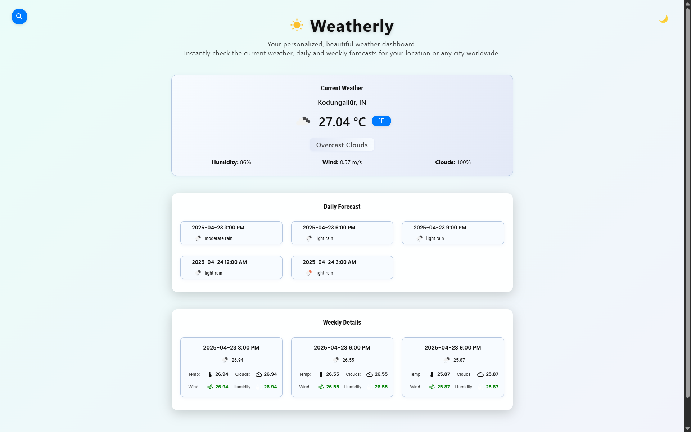

<br/>

# Weatherly ☀️

Weatherly is a beautiful, modern weather dashboard built with React.js, Material-UI, and styled-components. Instantly check the current weather, daily and weekly forecasts for your location or any city worldwide.  
Features include geolocation-based weather, city search, dark/light mode, Celsius/Fahrenheit toggle, and a responsive, professional UI.

<br/>

## 💻 Live Demo

[https://weatherly.netlify.app](https://weatherly.netlify.app)

<br/>

## ✨ Features

- 🌍 **Geolocation**: Automatically detects your location and shows local weather on launch.
- 🔍 **City Search**: Search for any city worldwide using the search icon in the corner.
- 🌗 **Dark/Light Mode**: Toggle between dark and light themes for comfortable viewing.
- 🌡️ **Celsius/Fahrenheit**: Instantly switch between Celsius and Fahrenheit units.
- 📅 **Daily & Weekly Forecasts**: View detailed daily and weekly weather, including temperature, wind, humidity, and more.
- 🎨 **Professional Design**: Responsive, accessible, and visually appealing UI with custom icons and backgrounds.

<br/>

## ✨ Getting Started

- Make sure you already have `Node.js` and `npm` installed in your system.
- You need an API key from [OpenWeatherMap](https://openweathermap.org/). After creating an account, [grab your key](https://home.openweathermap.org/api_keys).
- Under the `src/api` directory, open `OpenWeatherService.js` and replace `WEATHER_API_KEY` with your OpenWeatherMap API Key.

<br/>

## ⚡ Install

- Clone the repository:

```bash
git clone https://github.com/AshwinHarikumar/Weatherly.git
cd Weatherly
npm install
```

- Start the development server:

```bash
npm start
```

<br/>

## 📙 Used libraries

- `react`
- `styled-components`
- `@mui/material`
- `@mui/icons-material`
- `react-select-async-paginate`
- ...and more (see `package.json` for details)

<br/>


## 🙏 Thank You

If you like this project, please ⭐ the repo and share your feedback!

---
